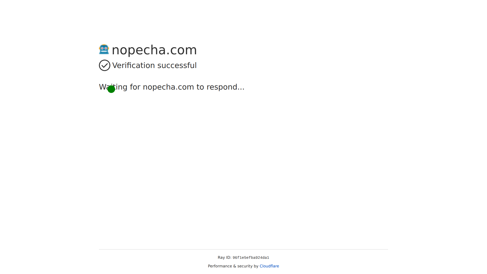

# puppeteer-headless

A headless browser utility for Puppeteer with custom patches for Cloudflare and worker environments.

## Screenshots

<details open>
  <summary>Nopecha</summary>



</details>
<details >
  <summary>Brotector</summary>


</details>
<details >
  <summary>Browserscan</summary>


</details>
<details >
  <summary>CreepJS</summary>


</details>
<details >
  <summary>IPHey</summary>


</details>
<details >
  <summary>Pixelscan</summary>


</details>
<details >
  <summary>ReBrowser</summary>


</details>
<details >
  <summary>Sannysoft</summary>


</details>
## Features

- **Custom patches and filters for Cloudflare and Worker environments**
- **Headless browser automation with Puppeteer**
- **Easy testability and extensible architecture**
- **Modern TypeScript support**

## Installation

```bash
bun install
```

or

```bash
npm install
```

## Usage

There are two main patch files in the project:

- `src/cfPatch.ts`: Applies custom patches and filters for Cloudflare environments.
- `src/workerPatch.ts`: Applies custom patches and filters for Worker environments.

Both files automatically apply the appropriate patches and filters for their respective environments.

## Build

```bash
bun run build
```

or

```bash
npm run build
```

## Test

Tests are written with `vitest`. To run the tests:

```bash
bun run test
```

or

```bash
npm run test
```

The tests automatically verify browser behavior and patch effects against various bot detection sites.

## Dependencies

- `puppeteer-core`
- `@sparticuz/chromium-min`
- `vitest` (for testing)
- `bun` (optional, for fast development)

## Contribution

Contributions are welcome! Please open an issue or submit a pull request.
